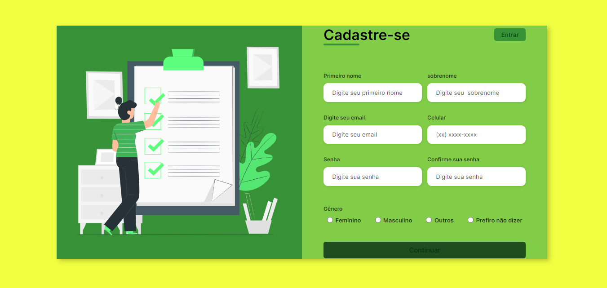

Formulário Responsivo de Cadastro

Este é um formulário responsivo de cadastro desenvolvido em HTML e CSS. O objetivo do formulário é permitir que os usuários preencham suas informações pessoais de maneira fácil e intuitiva.

Funcionalidades

* Layout responsivo que se adapta a diferentes dispositivos e tamanhos de tela.
* Campos de entrada para o primeiro nome, sobrenome, email, número de celular, senha e confirmação de senha.
* Opções de seleção de gênero.
* Estilizado com o framework de fonte aberta Inter para uma aparência moderna e legível.
* Validação básica dos campos de entrada usando os recursos HTML5.
* Design limpo e agradável para uma experiência de usuário agradável.
  
Como Usar

1. Clone o repositório para o seu ambiente local.
2. Abra o arquivo index.html em um navegador da web.
3. Preencha o formulário com as informações solicitadas.
4. Clique no botão "Continuar" para enviar o formulário.

Pré-visualização

Pré-visualização do formulário

Contribuição

Sinta-se à vontade para contribuir com melhorias, correções de bugs ou adicionar novos recursos ao formulário. Basta abrir uma pull request com suas alterações.

Licença

Este projeto está licenciado sob a Licença MIT.
